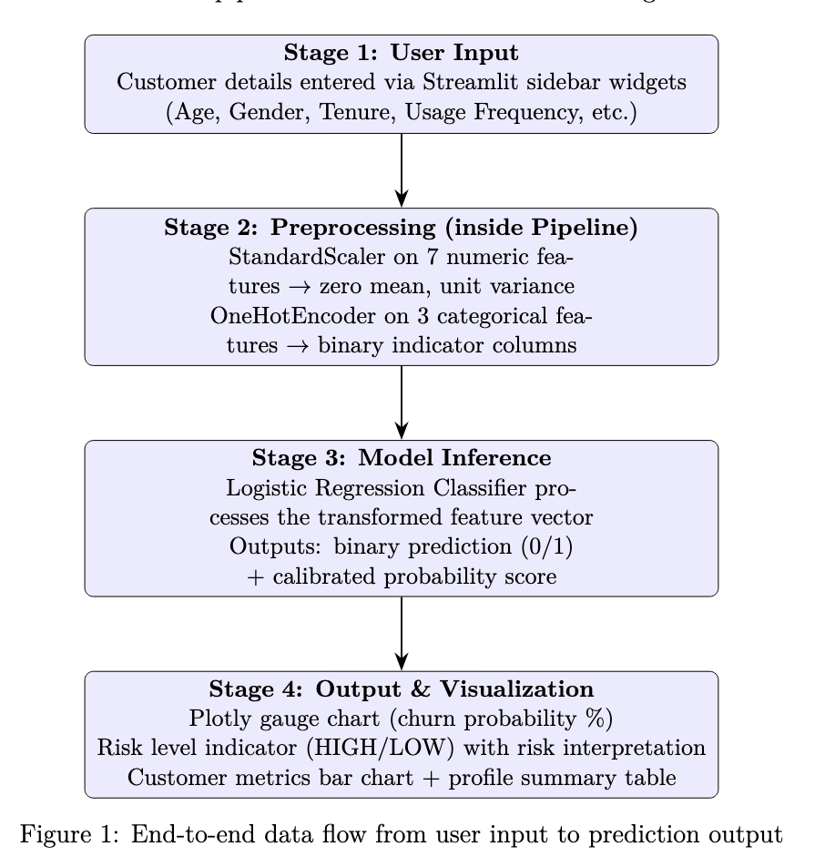

# Customer Churn Prediction — Project Documentation

## Table of Contents

- [Project Overview](#project-overview)
- [System Architecture](#system-architecture)
- [Project Structure](#project-structure)
- [Setup Instructions](#setup-instructions)
- [Dataset](#dataset)
- [ML Pipeline (Notebook)](#ml-pipeline-notebook)
- [Model Details](#model-details)
- [Streamlit Web App](#streamlit-web-app)
- [Visualizations](#visualizations)
- [Deployment](#deployment)
- [Key Observations](#key-observations)

---

## Project Overview

An **end-to-end Machine Learning project** that predicts customer churn using historical behavioral data. It includes:

- A **Jupyter Notebook** for data exploration, model training, and evaluation
- A **Streamlit web app** with Plotly visualizations for real-time churn predictions
- Deployment on **Hugging Face Spaces**

This is **Milestone 1** of a larger initiative to build an agentic AI retention strategist.

---

## System Architecture

Data flows from user input to prediction output through four stages. Below is the system architecture diagram illustrating the pipeline:



---

## Project Structure

```
customer-churn-prediction/
├── Assets/                                          (reserved for future assets)
├── Data/
│   └── customer_churn_dataset-testing-master.csv   # 64,374 rows of customer data
├── Model/
│   └── churn_model.pkl                             # Serialized Logistic Regression pipeline
├── Notebook/
│   └── GenAi-Capstone.ipynb                        # Training & evaluation notebook (Colab)
├── app.py                                          # Streamlit web app (180 lines)
├── requirements.txt                                # Python dependencies
├── doc.md                                          # Full codebase walkthrough
└── README.md                                       # This file
```

---

## Setup Instructions

### Prerequisites

- **Python 3.12** (or compatible)
- **pip** package manager

### Local Setup

1. **Clone the repository:**

   ```bash
   git clone <repository-url>
   cd customer-churn-prediction
   ```

2. **Install dependencies:**

   ```bash
   pip install -r requirements.txt
   ```

   This installs:
   | Package | Version | Purpose |
   |---|---|---|
   | streamlit | latest | Web app framework |
   | pandas | latest | Data manipulation |
   | scikit-learn | 1.6.1 | ML pipeline & model (pinned to match training) |
   | joblib | latest | Model serialization |
   | plotly | latest | Gauge chart & bar chart visualizations |

3. **Run the Streamlit app:**

   ```bash
   streamlit run app.py
   ```

   The app will open at `http://localhost:8501`.

> **Note:** The app expects `churn_model.pkl` in the working directory.

### Retraining the Model

1. Open `Notebook/GenAi-Capstone.ipynb` in Google Colab or Jupyter.
2. Run all cells. The last cell exports `churn_model.pkl` (Logistic Regression pipeline).
3. Copy the exported `.pkl` file to the project root for the Streamlit app.

---

## Dataset

**File:** `Data/customer_churn_dataset-testing-master.csv`

- **64,374 rows** × **12 columns**
- **Zero missing values**

| Column | Type | Range / Values | Description |
|---|---|---|---|
| CustomerID | int | 1–64,374 | Unique identifier (**dropped before training**) |
| Age | int | 18–65 | Customer's age in years |
| Gender | category | Male, Female | Customer's gender |
| Tenure | int | 1–60 | Months as a customer |
| Usage Frequency | int | 1–30 | Service usage frequency |
| Support Calls | int | 0–10 | Number of support calls |
| Payment Delay | int | 0–30 | Avg payment delay in days |
| Subscription Type | category | Basic, Standard, Premium | Subscription tier |
| Contract Length | category | Monthly, Quarterly, Annual | Contract duration |
| Total Spend | int | 100–1,000 | Total monetary spend ($) |
| Last Interaction | int | 1–30 | Days since last interaction |
| **Churn** (target) | binary | 0 (Stayed), 1 (Churned) | Target variable |

---

## ML Pipeline (Notebook)

The `GenAi-Capstone.ipynb` notebook follows this workflow:

1. **Install pinned scikit-learn** — `!pip install scikit-learn==1.6.1`
2. **Import libraries** — pandas, numpy, scikit-learn
3. **Load data** — `pd.read_csv()`, inspect with `.head()` and `.shape`
4. **Drop `CustomerID`** — sequential identifier with no predictive value
5. **Check nulls** — `df.isnull().sum()` → all zeros
6. **`dropna()`** — defensive measure for production robustness
7. **Split features/target** — `X = df.drop("Churn")`, `y = df["Churn"]`
8. **Train-test split** — 80/20, `random_state=42`
9. **Identify feature types** — 7 numeric, 3 categorical
10. **Build `ColumnTransformer`** — StandardScaler (numeric) + OneHotEncoder (categorical)
11. **Train Logistic Regression** — 83.17% accuracy, smoother probability estimates
12. **Train Decision Tree** — `max_depth=5` → **95.97% accuracy, 98.24% recall**
13. **Overfitting check** — train (95.63%) ≈ test (95.97%) → no overfitting
14. **Feature importance** — Payment Delay dominates at 47.9%
15. **Export model** — `joblib.dump(logistic_pipeline, "churn_model.pkl", compress=3)`

> **Why Logistic Regression for deployment?** While the Decision Tree achieved higher accuracy (96% vs 83%), Logistic Regression produces **smoother, well-calibrated probability estimates** that are more suitable for the gauge chart visualization and risk interpretation in the deployed app. The Decision Tree was used for analysis (feature importance) but not deployed.

---

## Model Details

### Model Comparison

| Metric | Logistic Regression | Decision Tree |
|---|---|---|
| Accuracy | 83.17% | **95.97%** |
| Precision | 81.63% | — |
| Recall | 83.06% | **98.24%** |
| F1-Score | 82.34% | — |

### Feature Importance (Decision Tree)

| Rank | Feature | Importance |
|---|---|---|
| 1 | Payment Delay | 0.4787 |
| 2 | Support Calls | 0.1440 |
| 3 | Tenure | 0.0991 |
| 4 | Usage Frequency | 0.0910 |
| 5 | Gender (Female) | 0.0828 |

### Confusion Matrix (Logistic Regression)

|  | Predicted: Stayed (0) | Predicted: Churned (1) |
|---|---|---|
| **Actual: Stayed (0)** | 5,656 | 1,137 |
| **Actual: Churned (1)** | 1,030 | 5,052 |

---

## Streamlit Web App

**File:** `app.py` (180 lines)

### Features

- **Sidebar inputs:** Sliders and dropdowns for all 10 features
- **Tabbed interface:** 📈 Prediction tab + 📊 Analytics tab
- **Gauge chart:** Speedometer-style churn probability visualization (Plotly)
- **Risk indicator:** Color-coded HIGH (red) / LOW (green) alert
- **Risk interpretation:** Three-tier contextual message
- **Customer metrics chart:** Bar chart of numeric input features (Plotly)
- **Profile summary:** DataFrame table showing all input features

### How It Works

1. Loads `churn_model.pkl` (Logistic Regression pipeline) at startup via `joblib.load()`
2. Collects user inputs through Streamlit sidebar widgets
3. Constructs a single-row `pandas.DataFrame` matching the training schema
4. Calls `model.predict()` for binary result + `model.predict_proba()` for probability
5. Displays results with gauge chart, risk alert, interpretation, and analytics

---

## Visualizations

### Why These Charts?

Visualizations were chosen to improve model **interpretability** and make the app **business-friendly**:

| Chart | What It Shows | Why It's Included |
|---|---|---|
| **Gauge Chart** | Churn probability (0–100%) | The model's main output is probability — a speedometer visual makes risk level immediately clear |
| **Customer Metrics Bar Chart** | Numeric feature values | Helps understand *why* a customer may be at risk (e.g., high Payment Delay, low Tenure) |
| **Customer Profile Table** | All input features | Creates a self-contained record for each prediction |

### What Was NOT Added (and Why)

- ❌ **Pie charts** — not meaningful for single-customer prediction
- ❌ **Random line charts** — no time-series data to plot
- ❌ **Excessive animations** — this is an ML prediction app, not a data analytics dashboard

---

## Deployment

### Hugging Face Spaces

The app is deployed on **Hugging Face Spaces**, which:

- Natively supports Streamlit apps
- Automatically builds from the Git repository
- Provides a public URL for anyone to test predictions
- Requires zero infrastructure management

### Deployment Steps

1. Push `app.py`, `churn_model.pkl`, and `requirements.txt` to a Hugging Face Space
2. Hugging Face detects the Streamlit SDK and installs dependencies
3. The app is live at the Space's public URL: [https://offxkavya-customer-churn-prediction.hf.space/](https://offxkavya-customer-churn-prediction.hf.space/)

---

## Key Observations

1. **Two models trained, one deployed**: Decision Tree (96% accuracy) provided feature importance insights; Logistic Regression (83% accuracy) was deployed for its smoother probability estimates
2. **Payment Delay is the #1 churn predictor** (47.9% feature importance)
3. The model is a **full pipeline** — raw categorical strings can be passed directly without manual encoding
4. The app uses **Plotly** for professional visualizations with a **tabbed interface**
5. scikit-learn is **pinned to 1.6.1** for version consistency between training and deployment
